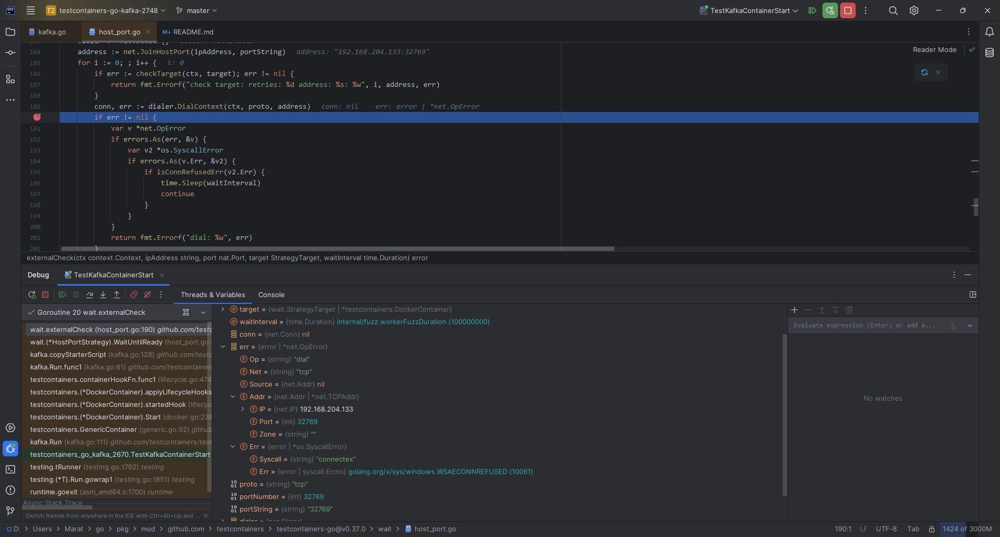

# Repro repo for testcontainers/testcontainers-go issue #2748

Reproducing https://github.com/testcontainers/testcontainers-go/issues/2748:

1. Environment
    1. Go SDK 1.23+
    1. Remote Docker Engine, e.g. VMware Workstation 17.6.3 VM with Rocky Linux 9.5 and Docker Engine 28.1.1:
        ```text
        $ docker -H 192.168.204.133:2375 version
        Client:
         Version:           28.1.1
         API version:       1.49
         Go version:        go1.23.8
         Git commit:        4eba377
         Built:             Fri Apr 18 09:53:24 2025
         OS/Arch:           windows/amd64
         Context:           default

        Server: Docker Engine - Community
         Engine:
          Version:          28.1.1
          API version:      1.49 (minimum version 1.24)
          Go version:       go1.23.8
          Git commit:       01f442b
          Built:            Fri Apr 18 09:52:20 2025
          OS/Arch:          linux/amd64
          Experimental:     false
         containerd:
          Version:          1.7.27
          GitCommit:        05044ec0a9a75232cad458027ca83437aae3f4da
         runc:
          Version:          1.2.5
          GitCommit:        v1.2.5-0-g59923ef
         docker-init:
          Version:          0.19.0
          GitCommit:        de40ad0
        ```
1. Run the test
    ```shell
    export MSYS_NO_PATHCONV=1 && \
    export DOCKER_HOST=tcp://192.168.204.133:2375 && \
    export TESTCONTAINERS_DOCKER_SOCKET_OVERRIDE=/var/run/docker.sock && \
    go test -v -count 1 ./...
    ```

Expected output of test (e.g. if using github.com/testcontainers/testcontainers-go/modules/kafka@v0.32.0 - refer to [feat/before_regression](https://github.com/mabrarov/testcontainers-go-kafka-2748/compare/master...feat/before_regression) branch of this repo)

```text
=== RUN   TestKafkaContainerStart
    testcontainers_kafka_test.go:14: starting container using image: confluentinc/confluent-local:7.5.0
2025/05/14 02:52:11 github.com/testcontainers/testcontainers-go - Connected to docker:
  Server Version: 28.1.1
  API Version: 1.48
  Operating System: Rocky Linux 9.5 (Blue Onyx)
  Total Memory: 15704 MB
  Testcontainers for Go Version: v0.37.0
  Resolved Docker Host: tcp://192.168.204.133:2375
  Resolved Docker Socket Path: /var/run/docker.sock
  Test SessionID: db9de1e48de703337acfa9f39543878259d08000b7f6ff9a13692d47fa4e34b9
  Test ProcessID: d6cf8bfa-90ed-4ef6-a1c2-1eefe6318776
2025/05/14 02:52:12 🐳 Creating container for image confluentinc/confluent-local:7.5.0
2025/05/14 02:52:12 🐳 Creating container for image testcontainers/ryuk:0.11.0
2025/05/14 02:52:12 ✅ Container created: a86ddd3f3e82
2025/05/14 02:52:12 🐳 Starting container: a86ddd3f3e82
2025/05/14 02:52:12 ✅ Container started: a86ddd3f3e82
2025/05/14 02:52:12 ⏳ Waiting for container id a86ddd3f3e82 image: testcontainers/ryuk:0.11.0. Waiting for: &{Port:8080/tcp timeout:<nil> PollInterval:100ms skipInternalCheck:false}
2025/05/14 02:52:12 🔔 Container is ready: a86ddd3f3e82
2025/05/14 02:52:12 ✅ Container created: 4c929ae6d96c
2025/05/14 02:52:12 🐳 Starting container: 4c929ae6d96c
2025/05/14 02:52:15 ✅ Container started: 4c929ae6d96c
2025/05/14 02:52:15 🔔 Container is ready: 4c929ae6d96c
    testcontainers_kafka_test.go:26: successfully started container: 4c929ae6d96c33d6d57a3da0e28d200a4b6e3772d81831dec9ce6f44394bbc1b
    testcontainers_kafka_test.go:20: terminating container: 4c929ae6d96c33d6d57a3da0e28d200a4b6e3772d81831dec9ce6f44394bbc1b
2025/05/14 02:52:15 🐳 Stopping container: 4c929ae6d96c
2025/05/14 02:52:25 ✅ Container stopped: 4c929ae6d96c
2025/05/14 02:52:25 🐳 Terminating container: 4c929ae6d96c
2025/05/14 02:52:25 🚫 Container terminated: 4c929ae6d96c
--- PASS: TestKafkaContainerStart (13.64s)
PASS
ok      github.com/mabrarov/testcontainers-go-kafka-2748        14.953s
```

Actual output of test when issue happens

```text
=== RUN   TestKafkaContainerStart
    testcontainers_kafka_test.go:14: starting container using image: confluentinc/confluent-local:7.5.0
2025/05/14 03:29:44 github.com/testcontainers/testcontainers-go - Connected to docker:
  Server Version: 28.1.1
  API Version: 1.48
  Operating System: Rocky Linux 9.5 (Blue Onyx)
  Total Memory: 15704 MB
  Testcontainers for Go Version: v0.37.0
  Resolved Docker Host: tcp://192.168.204.133:2375
  Resolved Docker Socket Path: /var/run/docker.sock
  Test SessionID: b2b2cbf29e975c2ae5087882dc0fb88ccd3ab22f446ccc916d703b184d0c5c75
  Test ProcessID: b7d6c017-1988-4b50-9593-22b34f2b177e
2025/05/14 03:29:44 🐳 Creating container for image confluentinc/confluent-local:7.5.0
2025/05/14 03:29:44 🐳 Creating container for image testcontainers/ryuk:0.11.0
2025/05/14 03:29:44 ✅ Container created: 1442a9f2eb60
2025/05/14 03:29:44 🐳 Starting container: 1442a9f2eb60
2025/05/14 03:29:44 ✅ Container started: 1442a9f2eb60
2025/05/14 03:29:44 ⏳ Waiting for container id 1442a9f2eb60 image: testcontainers/ryuk:0.11.0. Waiting for: &{Port:8080/tcp timeout:<nil> PollInterval:100ms skipInternalCheck:false}
2025/05/14 03:29:44 🔔 Container is ready: 1442a9f2eb60
2025/05/14 03:29:44 ✅ Container created: ce53b77607ed
2025/05/14 03:29:44 🐳 Starting container: ce53b77607ed
2025/05/14 03:30:44 ✅ Container started: ce53b77607ed
2025/05/14 03:30:44 container logs (copy starter script: wait for exposed port: external check: check target: retries: 28 address: 192.168.204.133:32840: get state: Get "http://192.168.204.133:2375/v1.48/containers/ce53b77607edc8c2833e03aacf24210aeee3dd3d9e28af7649dd825b09604c98/json": context deadline exceeded):

    testcontainers_kafka_test.go:17: container start failed: generic container: start container: started hook: copy starter script: wait for exposed port: external check: check target: retries: 28 address: 192.168.204.133:32840: get state: Get "http://192.168.204.133:2375/v1.48/containers/ce53b77607edc8c2833e03aacf24210aeee3dd3d9e28af7649dd825b09604c98/json": context deadline exceeded
--- FAIL: TestKafkaContainerStart (60.44s)
FAIL
FAIL    github.com/mabrarov/testcontainers-go-kafka-2748        61.754s
FAIL
```

Containers of the failed test look like

```text
$ docker ps -a
CONTAINER ID   IMAGE                                COMMAND                  CREATED          STATUS          PORTS                                                               NAMES
1442a9f2eb60   testcontainers/ryuk:0.11.0           "/bin/ryuk"              42 seconds ago   Up 41 seconds   0.0.0.0:32839->8080/tcp, [::]:32839->8080/tcp                       reaper_b2b2cbf29e975c2ae5087882dc0fb88ccd3ab22f446ccc916d703b184d0c5c75
ce53b77607ed   confluentinc/confluent-local:7.5.0   "sh -c 'while [ ! -f…"   42 seconds ago   Up 41 seconds   8082/tcp, 9092/tcp, 0.0.0.0:32840->9093/tcp, [::]:32840->9093/tcp   reverent_ritchie
$ docker logs ce53b77607ed
$ docker top ce53b77607ed
UID                 PID                 PPID                C                   STIME               TTY                 TIME                CMD
abrarovm            27456               27431               0                   03:29               ?                   00:00:00            sh -c while [ ! -f /usr/sbin/testcontainers_start.sh ]; do sleep 0.1; done; bash /usr/sbin/testcontainers_start.sh
abrarovm            28051               27456               0                   03:30               ?                   00:00:00            /usr/bin/coreutils --coreutils-prog-shebang=sleep /usr/bin/sleep 0.1
```

Please note that this issue doesn't happen if local Docker Engine is used,
e.g. if test runs inside VM mentioned in description of environment at the top of this file.
Docker bridge network is suspected to allow TCP connect to complete without error (and then TCP connection is reset)
even if respective port is not listened inside container.

# Local Docker Engine

Below are results of running this test on Rocky Linux 9.5 against **local** Docker Engine 28.1.1 where the test passes **successfully**.

Breakpoint is set at github.com/testcontainers/testcontainers-go/modules/kafka@v0.37.0/kafka.go:81 to pause the test at the point of time when container started, but Kafka (inside container) did not.

State of container with Kafka checked **from the same host** where Docker Engine runs when the test is stopped at breakpoint:

```text
$ docker ps -a
CONTAINER ID   IMAGE                                COMMAND                  CREATED          STATUS          PORTS                                                               NAMES
988a31f000ab   testcontainers/ryuk:0.11.0           "/bin/ryuk"              10 seconds ago   Up 10 seconds   0.0.0.0:33113->8080/tcp, [::]:33113->8080/tcp                       reaper_ae549cfb673b3b4e7bc6a35a328d726d9db4fd97492b44f3bf22e1b0ac2ce9c1
2b64550c358c   confluentinc/confluent-local:7.5.0   "sh -c 'while [ ! -f…"   11 seconds ago   Up 10 seconds   8082/tcp, 9092/tcp, 0.0.0.0:33114->9093/tcp, [::]:33114->9093/tcp   goofy_hypatia
$ docker top 2b64550c358c
UID                 PID                 PPID                C                   STIME               TTY                 TIME                CMD
abrarovm            211348              211323              0                   02:31               ?                   00:00:00            sh -c while [ ! -f /usr/sbin/testcontainers_start.sh ]; do sleep 0.1; done; bash /usr/sbin/testcontainers_start.sh
abrarovm            211580              211348              0                   02:31               ?                   00:00:00            /usr/bin/coreutils --coreutils-prog-shebang=sleep /usr/bin/sleep 0.1
$ docker logs 2b64550c358c
$ nc -vz 127.0.0.1 33114
Ncat: Version 7.92 ( https://nmap.org/ncat )
Ncat: Connected to 127.0.0.1:33114.
Ncat: 0 bytes sent, 0 bytes received in 0.01 seconds.
$ ./.build/dial 127.0.0.1:33114
Connected to: "127.0.0.1:33114"
```

State of container with Kafka checked in Git Bash **from remote host** running Windows 11 24H2 when the test is stopped at breakpoint:

```text
$ docker ps -a
CONTAINER ID   IMAGE                                COMMAND                  CREATED              STATUS              PORTS                                                               NAMES
988a31f000ab   testcontainers/ryuk:0.11.0           "/bin/ryuk"              About a minute ago   Up About a minute   0.0.0.0:33113->8080/tcp, [::]:33113->8080/tcp                       reaper_ae549cfb673b3b4e7bc6a35a328d726d9db4fd97492b44f3bf22e1b0ac2ce9c1
2b64550c358c   confluentinc/confluent-local:7.5.0   "sh -c 'while [ ! -f…"   About a minute ago   Up About a minute   8082/tcp, 9092/tcp, 0.0.0.0:33114->9093/tcp, [::]:33114->9093/tcp   goofy_hypatia
$ docker top 2b64550c358c
UID                 PID                 PPID                C                   STIME               TTY                 TIME                CMD
abrarovm            211348              211323              0                   02:31               ?                   00:00:00            sh -c while [ ! -f /usr/sbin/testcontainers_start.sh ]; do sleep 0.1; done; bash /usr/sbin/testcontainers_start.sh
abrarovm            212461              211348              0                   02:32               ?                   00:00:00            /usr/bin/coreutils --coreutils-prog-shebang=sleep /usr/bin/sleep 0.1
$ docker logs 2b64550c358c
$ ./.build/dial.exe 192.168.204.133:33114
Dial error: &os.SyscallError{Syscall:"connectex", Err:0x274d}
```

State of container with Kafka checked in PowerShell 5.1 **from remote host** running Windows 11 24H2 when the test is stopped at breakpoint:

```text
> Test-NetConnection -InformationLevel "Detailed" -ComputerName 192.168.204.133 -Port 33114                                                                         
TCP connect to (192.168.204.133 : 33114) failed                                                                                                                                                                     
ComputerName            : 192.168.204.133
RemoteAddress           : 192.168.204.133
RemotePort              : 33114
NameResolutionResults   : 192.168.204.133
                          dev.local
MatchingIPsecRules      :
NetworkIsolationContext : Internet
IsAdmin                 : False
InterfaceAlias          : VMware Network Adapter VMnet8
SourceAddress           : 192.168.204.1
NetRoute (NextHop)      : 0.0.0.0
PingSucceeded           : True
PingReplyDetails (RTT)  : 0 ms
TcpTestSucceeded        : False
```

State of container with Kafka checked **from remote host** running Ubuntu 24.04 and connected to the same network when the test is stopped at breakpoint:

```text
$ nc -vz 192.168.204.133 33114
nc: connect to 192.168.204.133 port 33114 (tcp) failed: Connection refused
$ ./.build/dial 192.168.204.133:33114
Dial error: &os.SyscallError{Syscall:"connect", Err:0x6f}
```

Output of test:

```text
=== RUN   TestKafkaContainerStart
    testcontainers_kafka_test.go:16: starting container using image: confluentinc/confluent-local:7.5.0
    testcontainers_kafka_test.go:28: successfully started container: 2b64550c358c68e9a970a3a4660ee4ed2dce6238907e0bfae8a94ca63a927398
    testcontainers_kafka_test.go:22: terminating container: 2b64550c358c68e9a970a3a4660ee4ed2dce6238907e0bfae8a94ca63a927398
--- PASS: TestKafkaContainerStart (143.81s)
PASS
```

# Remote Docker Engine

Below are results of running this test on Windows 11 24H2 against **remote** Docker Engine 28.1.1 (192.168.204.133:2375) running on Rocky Linux 9.5 (192.168.204.133) where the test **fails**.

Breakpoint is set at github.com/testcontainers/testcontainers-go/modules/kafka@v0.37.0/kafka.go:81 to pause the test at the point of time when container started, but Kafka (inside container) did not.

State of container with Kafka checked from **the same host** where Docker Engine runs when the test is stopped at breakpoint:

```text
$ docker ps -a
CONTAINER ID   IMAGE                                COMMAND                  CREATED          STATUS          PORTS                                                               NAMES
7b4fe6f9b360   testcontainers/ryuk:0.11.0           "/bin/ryuk"              16 seconds ago   Up 15 seconds   0.0.0.0:32768->8080/tcp, [::]:32768->8080/tcp                       reaper_6461954d8f181db3edcf1c530cc39b02e69704ae64584bed88dcb9723931b3ed
aab913cad229   confluentinc/confluent-local:7.5.0   "sh -c 'while [ ! -f…"   16 seconds ago   Up 12 seconds   8082/tcp, 9092/tcp, 0.0.0.0:32769->9093/tcp, [::]:32769->9093/tcp   bold_lichterman
$ docker top aab913cad229
UID                 PID                 PPID                C                   STIME               TTY                 TIME                CMD
abrarovm            2512                2489                1                   13:46               ?                   00:00:00            sh -c while [ ! -f /usr/sbin/testcontainers_start.sh ]; do sleep 0.1; done; bash /usr/sbin/testcontainers_start.sh
$ docker logs aab913cad229
$ nc -vz 127.0.0.1 32769
Ncat: Version 7.92 ( https://nmap.org/ncat )
Ncat: Connected to 127.0.0.1:32769.
Ncat: 0 bytes sent, 0 bytes received in 0.02 seconds.
$ ./.build/dial 127.0.0.1:32769
Connected to: "127.0.0.1:32769"
$ ip address show | grep 192
    inet 192.168.204.133/24 brd 192.168.204.255 scope global dynamic noprefixroute ens160
$ nc -vz 192.168.204.133 32769
Ncat: Version 7.92 ( https://nmap.org/ncat )
Ncat: Connection refused.
$ ./.build/dial 192.168.204.133:32769
Dial error: &os.SyscallError{Syscall:"connect", Err:0x6f}
```

State of container with Kafka checked in Git Bash **from remote host** where the test runs when the test is stopped at breakpoint:

```text
$ docker ps -a
CONTAINER ID   IMAGE                                COMMAND                  CREATED         STATUS         PORTS                                                               NAMES
7b4fe6f9b360   testcontainers/ryuk:0.11.0           "/bin/ryuk"              2 minutes ago   Up 2 minutes   0.0.0.0:32768->8080/tcp, [::]:32768->8080/tcp                       reaper_6461954d8f181db3edcf1c530cc39b02e69704ae64584bed88dcb9723931b3ed
aab913cad229   confluentinc/confluent-local:7.5.0   "sh -c 'while [ ! -f…"   2 minutes ago   Up 2 minutes   8082/tcp, 9092/tcp, 0.0.0.0:32769->9093/tcp, [::]:32769->9093/tcp   bold_lichterman
$ docker top aab913cad229
UID                 PID                 PPID                C                   STIME               TTY                 TIME                CMD
abrarovm            2512                2489                0                   13:46               ?                   00:00:01            sh -c while [ ! -f /usr/sbin/testcontainers_start.sh ]; do sleep 0.1; done; bash /usr/sbin/testcontainers_start.sh
abrarovm            4210                2512                0                   13:49               ?                   00:00:00            /usr/bin/coreutils --coreutils-prog-shebang=sleep /usr/bin/sleep 0.1
$ docker logs aab913cad229
$ ./.build/dial 192.168.204.133:32769
Dial error: &os.SyscallError{Syscall:"connectex", Err:0x274d}
```

State of container with Kafka checked in PowerShell 5.1 **from remote host** where the test runs when the test is stopped at breakpoint:

```text
> Test-NetConnection -InformationLevel "Detailed" -ComputerName 192.168.204.133 -Port 32769                                                                         
TCP connect to (192.168.204.133 : 32769) failed
ComputerName            : 192.168.204.133
RemoteAddress           : 192.168.204.133
RemotePort              : 32769
NameResolutionResults   : 192.168.204.133
                          dev.local
MatchingIPsecRules      :
NetworkIsolationContext : Internet
IsAdmin                 : False
InterfaceAlias          : VMware Network Adapter VMnet8
SourceAddress           : 192.168.204.1
NetRoute (NextHop)      : 0.0.0.0
PingSucceeded           : True
PingReplyDetails (RTT)  : 0 ms
TcpTestSucceeded        : False
```

State of container with Kafka checked **from remote host** running Ubuntu 24.04 and connected to the same network when the test is stopped at breakpoint:

```text
$ nc -vz 192.168.204.133 32769
nc: connect to 192.168.204.133 port 32769 (tcp) failed: Connection refused
$ ./.build/dial 192.168.204.133:32769
Dial error: &os.SyscallError{Syscall:"connect", Err:0x6f}
```

Output of test:

```text
=== RUN   TestKafkaContainerStart
    testcontainers_kafka_test.go:16: starting container using image: confluentinc/confluent-local:7.5.0
    testcontainers_kafka_test.go:19: container start failed: generic container: start container: started hook: copy starter script: wait for exposed port: external check: dial: dial tcp 192.168.204.133:32769: i/o timeout
--- FAIL: TestKafkaContainerStart (399.42s)

FAIL
```

The place where the test is stuck in debugger


